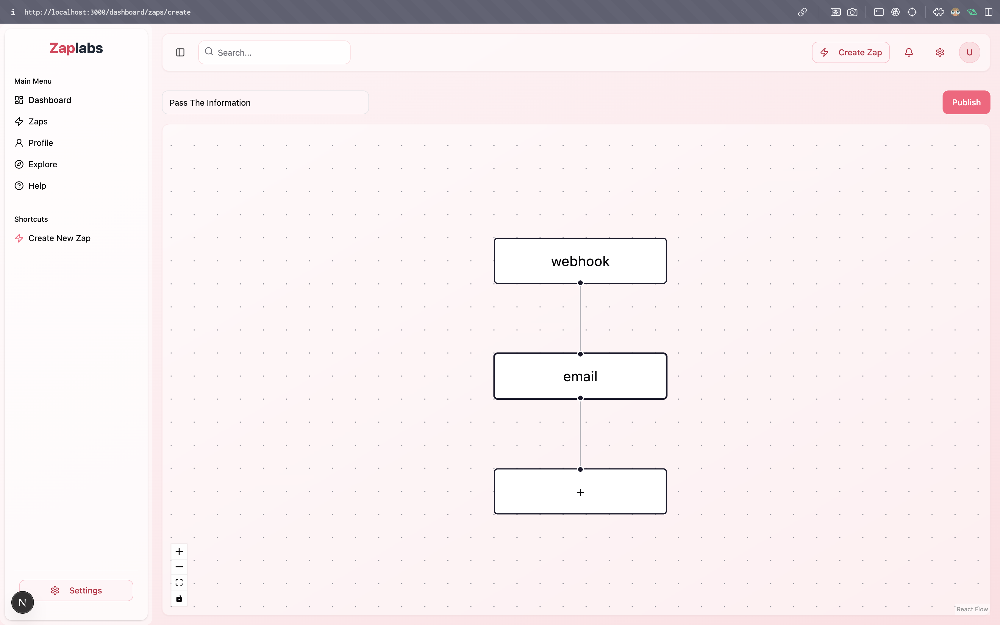
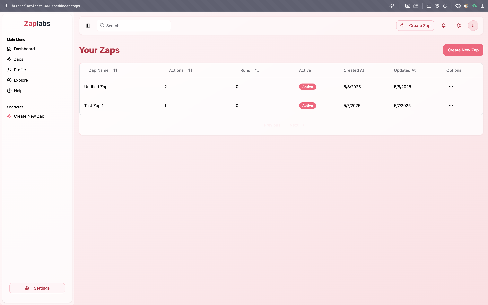
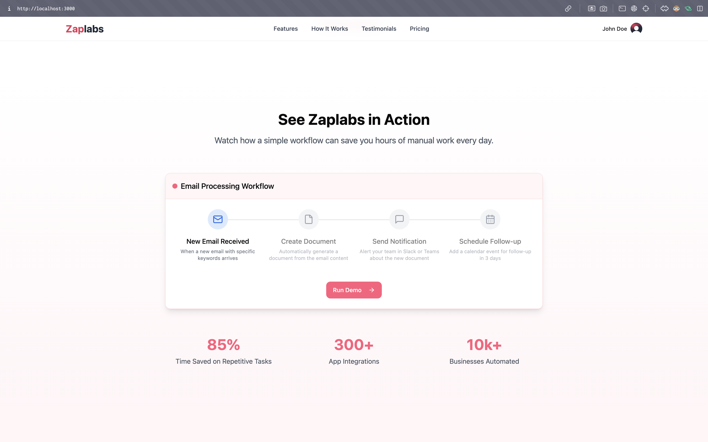
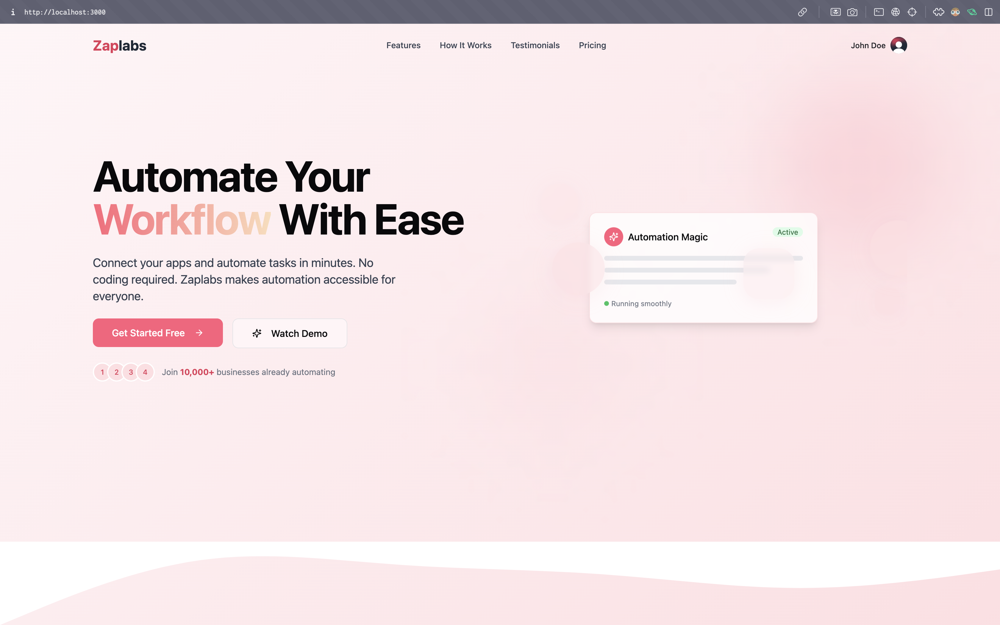
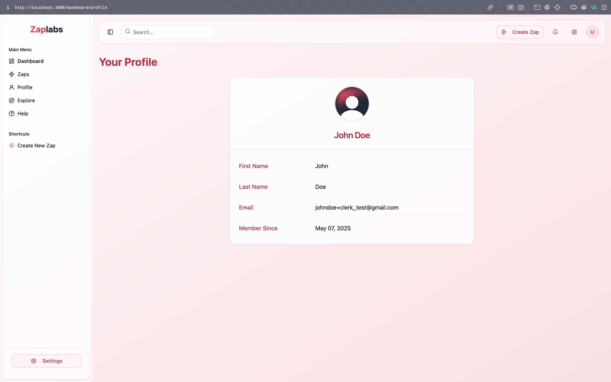
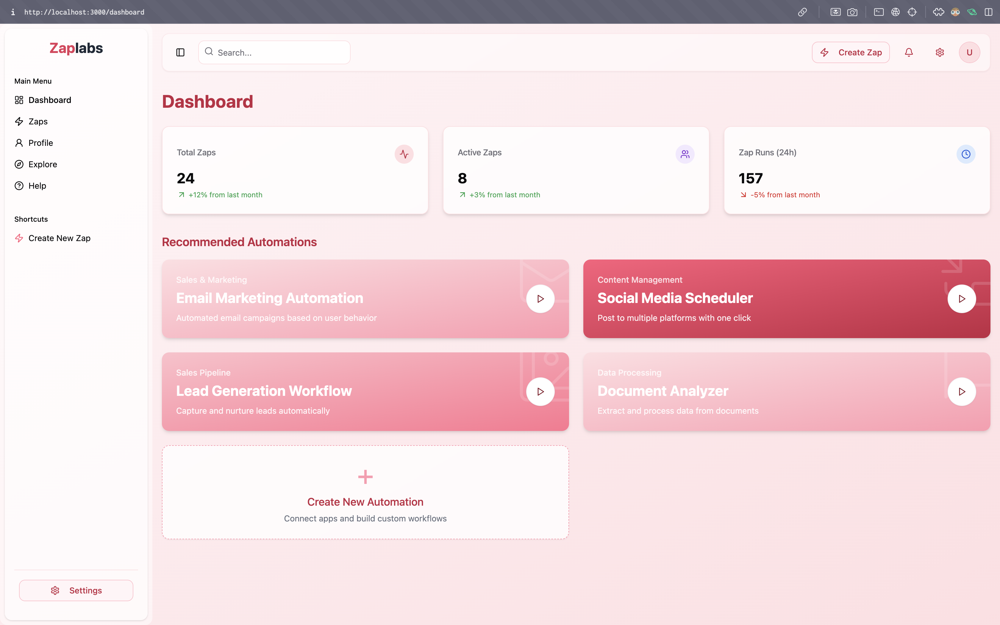
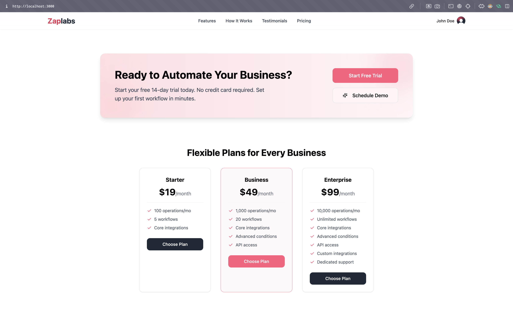

# ⚡ Zaplabs - Automation Reimagined

**Zaplabs** is a modern automation platform that enables users to build powerful, cross-platform workflows using a
drag-and-drop interface. Designed to simplify integration between services, Zaplabs allows anyone—from developers to
no-code enthusiasts—to create, monitor, and manage automation pipelines with ease.

> Your one-stop control center for seamless, intelligent automation.

---

## 📑 Table of Contents

1. [Overview](#-overview)
2. [Tech Stack](#-tech-stack)
3. [Packages & Libraries](#-packages--libraries)
4. [Getting Started](#-getting-started)
5. [Setup](#-setup)
6. [Features](#-features)
7. [Demo & Screenshots](#-demo--screenshots)
8. [Acknowledgments](#-acknowledgments)
9. [License](#-license)

---

## 🌟 Overview

Zaplabs empowers you to:

- Connect disparate services
- Automate workflows visually
- Execute tasks reliably with autonomy
- Focus on outcomes instead of infrastructure

---

## 🧠 Tech Stack

| Technology   | Description                                  |
|--------------|----------------------------------------------|
| Typescript   | Language for scalable frontend/backend logic |
| Next.js      | Frontend framework                           |
| Node.js      | Backend server logic                         |
| Kafka        | Message queue for async automation tasks     |
| PostgreSQL   | Relational database                          |
| Tailwind CSS | UI styling                                   |

---

## 📦 Packages & Libraries Used

- [`prisma`](https://www.prisma.io/)
- [`Shadcn UI`](https://ui.shadcn.dev/)
- [`React Flow`](https://reactflow.dev/)
- [`React Hook Form`](https://react-hook-form.com/)
- [`TanStack Query`](https://tanstack.com/query/latest)
- [`Zod`](https://zod.dev/)
- [`Jotai`](https://jotai.org/)
- [`Clerk`](https://clerk.dev/)
- [`Kafka.js`](https://kafka.js.org/)
- [`Express.js`](https://expressjs.com/)
- [`Axios`](https://axios-http.com/)

---

## 🚀 Getting Started

Make sure you have **Node.js**, **PostgreSQL**, and **Kafka** installed locally.

---

## ⚙️ Setup

1. Clone the repository:
   ```bash
   git clone <repo_url>
   ```

2. Navigate to the project directory:

   ```bash
   cd zaplabs
   ```
3. Open in IDE (VS Code or WebStorm)
4. Install dependencies:

   ```bash
   pnpm install   # or npm / yarn
   ```
5. Run the project:

   ```bash
   pnpm dev
   ```

---

## 🎯 Features

* 🔐 **Frictionless Onboarding**
  Quick authentication via Clerk to get started instantly

* 🔌 **Visual Flow Builder**
  Drag-and-drop interface built using **React Flow**

* ⏱️ **Autonomous Execution**
  Kafka-based background execution engine for reliable workflows

* 🧩 **Cross-Platform Integration**
  API + custom integrations to connect any tool or service

---

## 📸 Demo & Screenshots

## 📸 Demo & Screenshots

| Screen Name           | Screenshot                                                |
|-----------------------|-----------------------------------------------------------|
| **Create Zap Screen** |  |
| **Your Zaps Screen**  |    |
| **Zaplabs in Action** |  |
| **Automate Workflow** |  |
| **User Profile**      |            |
| **Dashboard**         |                  |
| **Pricing Plans**     |          |

---

## 🙏 Acknowledgments

1. [React Flow Docs](https://reactflow.dev/)
2. [Shadcn UI Docs](https://ui.shadcn.dev/)
3. [Harkirat Singh - 100xDevs Cohort 2](https://www.100xdevs.com/)

---

## 📜 License

This project is licensed under the **MIT License**.

---

> Built to empower builders. Zap. Automate. Simplify.
